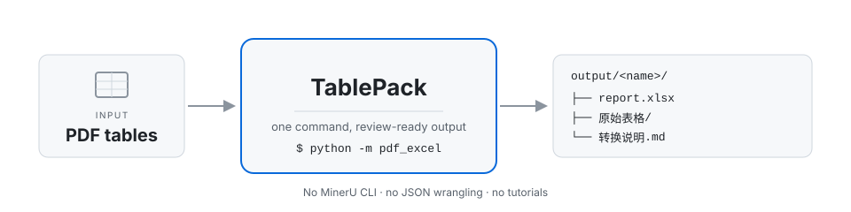

<div align="center">

# TablePack

**PDF tables → multi-sheet Excel packages you can actually accept**

One command: drop in PDFs, get a review-ready Excel package · original table screenshots for QC · no MinerU tutorial required

[](https://www.python.org/downloads/)
[](LICENSE)
[](https://github.com/opendatalab/MinerU)
[](skills/pdf-table-to-excel/SKILL.md)
[](https://github.com/kujiangmudao/tablepack/stargazers)

[简体中文](README.md) · **English** (this page)

[Quick start](#quick-start) · [Preview](#preview) · [Install](#install) · [CLI](#cli) · [Agent skill](#agent-skill) · [Docs](#docs)

</div>



## Why TablePack

[MinerU](https://github.com/opendatalab/MinerU) is a strong parsing engine. But if all you want is "turn the tables in this paper / report into Excel", the last mile is steep: CLI flags, backend choices, `content_list` JSON, export formats. TablePack packs that last mile into one command — with reviewability built in:

- **One PDF → one Excel**, one sheet per table
- **`原始表格/` crops** saved next to every package — QC without extra tooling
- Empty / broken tables → **written into notes, never invented data**
- Ships with an [agent skill](skills/pdf-table-to-excel/SKILL.md): the same SOP for humans and agents

## Quick start

```bash
git clone https://github.com/kujiangmudao/tablepack.git
cd tablepack
pip install -r requirements.txt

cp examples/demo/demo_sample.pdf pdf/
python -m pdf_excel          # then open output/demo_sample/
```

Prerequisite: MinerU already installed — **installed is all you need; you never have to learn its CLI**. No MinerU yet? Use the one-shot script in [Install](#install).

## Preview

<!-- GIF: replace with  once recorded -->

<p align="center">
  
  &nbsp;&nbsp;
  
</p>

Left: the `原始表格/` crop saved for each table (for review) · Right: the packaged Excel sheet

## Install

### Path A — MinerU already installed

You only need this repo. TablePack finds `mineru` on `PATH` automatically (or reads `mineru_bin` from `config.yaml`).

```bash
git clone https://github.com/kujiangmudao/tablepack.git
cd tablepack
pip install -r requirements.txt
cp config.example.yaml config.yaml   # optional; only if mineru is not on PATH
```

### Path B — No MinerU yet (one-shot install)

The script creates a project-local venv (`.venv-mineru`), installs official `mineru[all]` plus this project's deps, and writes `config.yaml`. It does **not** touch your global site-packages — after setup you only ever run TablePack, never the MinerU CLI by hand.

**Windows (PowerShell)**

```powershell
git clone https://github.com/kujiangmudao/tablepack.git
cd tablepack
powershell -ExecutionPolicy Bypass -File scripts\install_mineru.ps1
.\.venv-mineru\Scripts\Activate.ps1
python -m pdf_excel --dry-config   # verify env & config
```

**Linux / macOS**

```bash
git clone https://github.com/kujiangmudao/tablepack.git
cd tablepack
chmod +x scripts/install_mineru.sh
./scripts/install_mineru.sh
source .venv-mineru/bin/activate
python -m pdf_excel --dry-config   # verify env & config
```

Then follow [Quick start](#quick-start) to run the demo. Full detail: [docs/INSTALL.md](docs/INSTALL.md).

## CLI

| I want to… | Command |
|------------|---------|
| Convert every PDF in `pdf/` | `python -m pdf_excel` |
| Force re-convert and overwrite | `python -m pdf_excel --force` |
| Only convert files not yet converted | `python -m pdf_excel --skip-existing` |
| Only files whose name contains a keyword | `python -m pdf_excel keyword` |
| Check environment & config | `python -m pdf_excel --dry-config` |

Inspect a sample package without running anything: [`examples/demo_output/demo_sample/`](examples/demo_output/demo_sample/)

Package layout:

```text
output/<name>/
  ├── <name>.xlsx
  ├── 原始表格/
  ├── 图片/
  └── 转换说明.md or 问题说明.md
```

## Agent skill

Works with OpenCode, Cursor, Claude Code, and any agent that can read a skill file.

| | |
|--|--|
| Skill | [`skills/pdf-table-to-excel/SKILL.md`](skills/pdf-table-to-excel/SKILL.md) |
| Rules | [`AGENTS.md`](AGENTS.md) |
| Triggers | `转表格`, `转excel`, `mineru`, `再转一批`, `/pdf-table-to-excel` |

1. Prefer opening **this repo as the workspace** (CLI + skill together)
2. Path B users: activate `.venv-mineru` so agents run in the same environment
3. For visual QC (opening `原始表格/*.jpg`), a **multimodal** model works best

Drop into any agent (one raw URL):

```text
https://raw.githubusercontent.com/kujiangmudao/tablepack/main/skills/pdf-table-to-excel/SKILL.md
```

## Project layout

```text
tablepack / pdf_excel
├── pdf_excel/                 # Python package (python -m pdf_excel)
├── skills/pdf-table-to-excel/ # agent skill
├── scripts/install_mineru.*   # Path B setup
├── examples/demo/             # synthetic demo PDF
├── docs/INSTALL.md
├── docs/assets/               # README screenshots & flow diagram
└── AGENTS.md
```

## Docs

- [Install (Path A / B)](docs/INSTALL.md)
- [QC checklist](docs/QC_CHECKLIST.md)
- [Architecture](docs/ARCHITECTURE.md)
- [Troubleshooting](docs/TROUBLESHOOTING.md)
- [Contributing](CONTRIBUTING.md)

## License & credits

[MIT](LICENSE) · Parsing engine: [MinerU](https://github.com/opendatalab/MinerU) · Excel: [openpyxl](https://openpyxl.readthedocs.io/)

**You own final data correctness — verify against the source PDF before production use.**
