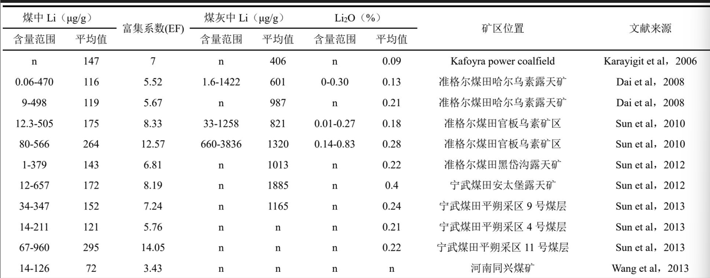
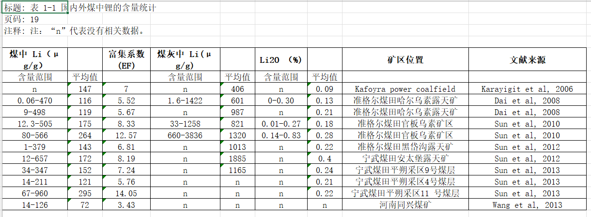

# pdf-excel

[](https://www.python.org/downloads/)
[](LICENSE)
[](https://github.com/opendatalab/MinerU)
[](skills/pdf-table-to-excel/SKILL.md)

**中文说明 → [README.zh-CN.md](README.zh-CN.md)**

### PDF tables → deliverable Excel packages (for humans **and** AI agents)

Turn academic / technical PDFs into **reviewable** outputs—not a lonely CSV:

| Pain | What you get |
|------|----------------|
| Tables locked in PDFs | One workbook per PDF, **one sheet per table** |
| Hard to verify OCR | **`原始表格/`** cropped table screenshots beside the xlsx |
| Agents invent numbers | Policy: **document failures, never fabricate rows** |
| One-off scripts | Reusable **CLI + config + agent skill** |

> **one PDF → one Excel → folder with screenshots + notes → visual QC**

Powered by [MinerU](https://github.com/opendatalab/MinerU). Orchestration, packaging, and QC discipline live here.

---

## See it in 10 seconds

**Original table crop** (from `原始表格/`):



**Excel sheet after packaging** (metadata + grid):



```text
output/<pdf_stem>/
  ├── <pdf_stem>.xlsx      # all tables as sheets
  ├── 原始表格/            # table crops for QC
  ├── 图片/                # figures / charts
  └── 转换说明.md | 问题说明.md
```

---

## Quick start (CLI)

```bash
git clone https://github.com/kujiangmudao/pdf-excel.git
cd pdf-excel
pip install -r requirements.txt

# optional: machine-local paths
cp config.example.yaml config.yaml
# set mineru_bin if `mineru` is not on PATH

# try the copyright-safe synthetic PDF (no private theses)
cp examples/demo/demo_sample.pdf pdf/
python -m pdf_excel demo_sample

# or drop your own PDFs into pdf/ then:
python -m pdf_excel
```

**Requirements:** Python 3.10+, [MinerU](https://github.com/opendatalab/MinerU) CLI, dependencies in `requirements.txt`.  
CPU-friendly default: `backend: pipeline`.

Prebuilt sample package (no MinerU needed to inspect layout):

- [`examples/demo_output/demo_sample/`](examples/demo_output/demo_sample/)

Regenerate demo PDF/package:

```bash
pip install reportlab pillow
python examples/build_demo.py
```

---

## Use the agent skill (OpenCode / Cursor / Claude / …)

This repo ships a portable skill so agents run the **same SOP** every batch.

| Item | Value |
|------|--------|
| Skill path | [`skills/pdf-table-to-excel/SKILL.md`](skills/pdf-table-to-excel/SKILL.md) |
| Raw URL | https://raw.githubusercontent.com/kujiangmudao/pdf-excel/main/skills/pdf-table-to-excel/SKILL.md |
| Repo rules | [`AGENTS.md`](AGENTS.md) |

**OpenCode / install by GitHub**

1. Clone or open this repository as the workspace (recommended: full pipeline + skill).
2. Or point your skill installer at:
   - repo: `kujiangmudao/pdf-excel`
   - skill: `skills/pdf-table-to-excel`
3. Triggers: `转表格`, `转excel`, `mineru`, `再转一批`, `/pdf-table-to-excel`, …

### Multimodal note (important)

| Stage | Vision needed? |
|-------|----------------|
| `python -m pdf_excel` packaging | No |
| **QC: open `原始表格/*.jpg` and fix sheets** | **Yes** |

Text-only models may run the CLI and write notes, but **must not** claim visual QC was done.

---

## Why not only Camelot / Tabula / plain MinerU?

| Tooling | Typical end state | This project |
|---------|-------------------|--------------|
| Camelot / Tabula | CSV / xlsx | Full **folder deliverable** + screenshots |
| MinerU alone | Markdown / JSON / HTML tables | Excel package + QC notes + agent rules |
| Auto pipelines | “Looks fine” | Explicit **no fabricated data** policy |

Real-world hard cases this workflow was built around: multi-level Chinese headers, empty MinerU `table_body` nodes, landscape tables, oxide OCR noise (`Al2O3`, `w/%`), multi-page splits.

---

## CLI cheat sheet

```text
python -m pdf_excel --dry-config
python -m pdf_excel --force
python -m pdf_excel --skip-existing
python -m pdf_excel 关键词
```

| Flag | Effect |
|------|--------|
| `--force` | Re-run MinerU even if cache exists |
| `--keep-empty-tables` | Keep empty HTML tables (default: drop) |
| `--skip-existing` | Skip packages that already have xlsx |

Env overrides: `MINERU_BIN`, `PDF_EXCEL_PDF_DIR`, `PDF_EXCEL_OUTPUT_DIR`, `PDF_EXCEL_WORK_DIR`, … (see `config.example.yaml`).

---

## Quality control checklist

Automation is ~70–90%. Delivery needs visual QC:

1. Open `原始表格/表N_*.jpg`
2. Check headers, dimensions, merges, IDs, numbers
3. Fix the sheet when wrong
4. If unrecoverable → `问题说明.md` (no invented cells)

Details: [docs/QC_CHECKLIST.md](docs/QC_CHECKLIST.md) · [docs/ARCHITECTURE.md](docs/ARCHITECTURE.md) · [docs/TROUBLESHOOTING.md](docs/TROUBLESHOOTING.md)

---

## Project layout

```text
pdf-excel/
├── pdf_excel/                 # installable package
├── convert_pipeline.py        # thin entry
├── skills/pdf-table-to-excel/ # agent skill
├── examples/demo/             # synthetic PDF
├── examples/demo_output/      # sample package
├── docs/assets/               # README screenshots
├── AGENTS.md
└── README.zh-CN.md
```

---

## What we deliberately do not do

- Ship copyrighted theses as samples (use `examples/demo/` synthetic data)
- Invent rows when MinerU returns empty HTML
- Claim 100% accuracy without visual QC
- Replace MinerU’s parser (we orchestrate + package + enforce QC)

---

## Star / contribute

If this helps your research desk, data pipeline, or agent workflow:

- Star the repo
- Open an issue with a **redacted** hard table (HTML snippet or crop you can share)
- PRs: see [CONTRIBUTING.md](CONTRIBUTING.md)

## License

[MIT](LICENSE) · Acknowledgments: [MinerU](https://github.com/opendatalab/MinerU), [openpyxl](https://openpyxl.readthedocs.io/)

## Disclaimer

You own final data correctness. Always verify against the original PDF before publication or commercial use.
