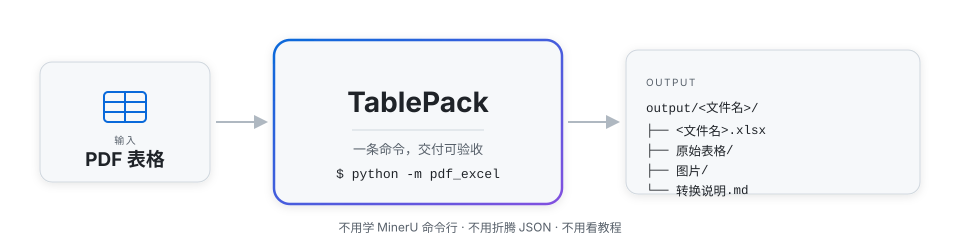

<div align="center">

# TablePack

**PDF 表格 → 可验收的多 sheet Excel 交付包**

一条命令：PDF 放进去，Excel 交付包出来 · 附原始表格截图方便核对 · 不用看 MinerU 教程

[](https://www.python.org/downloads/)
[](LICENSE)
[](https://github.com/opendatalab/MinerU)
[](skills/pdf-table-to-excel/SKILL.md)
[](https://github.com/kujiangmudao/tablepack/stargazers)

**简体中文**（当前页） · [English](README.md)

[快速开始](#快速开始) · [效果预览](#效果预览) · [安装](#安装) · [场景与命令](#场景与命令) · [Agent 用法](#agent-用法) · [文档](#文档)

</div>



## 为什么是 TablePack

[MinerU](https://github.com/opendatalab/MinerU) 的解析能力很强，但"只想把论文 / 报告里的表格变成 Excel"的人，往往卡在最后一公里：命令行参数、backend 选择、`content_list` JSON、导出格式……TablePack 把这一公里封成一条命令，并把「可核对」一起做进去：

- **一个 PDF → 一个 Excel**，一表一 sheet
- 同目录 **`原始表格/` 截图**，逐表核对不依赖任何工具
- 空表 / 坏表**写进说明文件，绝不编造数据**
- 自带 [Agent Skill](skills/pdf-table-to-excel/SKILL.md)：人用、AI 用，同一套 SOP

## 快速开始

```bash
git clone https://github.com/kujiangmudao/tablepack.git
cd tablepack
pip install -r requirements.txt

cp examples/demo/demo_sample.pdf pdf/
python -m pdf_excel          # 打开 output/demo_sample/
```

前提：环境里已装好 MinerU——**只需要装好，不需要会用**。还没装的话，见下面[安装](#安装)章节的路径 B 一键脚本。

## 效果预览

<!-- GIF 占位：录好后替换为  -->

<p align="center">
  
  &nbsp;&nbsp;
  
</p>

左：`原始表格/` 里为每个表留下的截图（核对用） · 右：打包后的 Excel sheet

## 安装

### 路径 A — 已经有 MinerU（不必会用）

只需要本仓库。TablePack 会自动找到 `mineru`（不在 PATH 时读 `config.yaml` 里的 `mineru_bin`）。

```bash
git clone https://github.com/kujiangmudao/tablepack.git
cd tablepack
pip install -r requirements.txt
cp config.example.yaml config.yaml   # 可选；仅当 mineru 不在 PATH 时需要
```

### 路径 B — 还没有 MinerU（一键安装）

脚本在项目内创建独立虚拟环境 `.venv-mineru`，安装官方 `mineru[all]` + 本项目依赖，并写好 `config.yaml`。**不污染**系统全局 site-packages；之后你只用 TablePack，不必学 MinerU 官方 CLI。

**Windows（PowerShell）**

```powershell
git clone https://github.com/kujiangmudao/tablepack.git
cd tablepack
powershell -ExecutionPolicy Bypass -File scripts\install_mineru.ps1
.\.venv-mineru\Scripts\Activate.ps1
python -m pdf_excel --dry-config   # 检查环境与配置
```

**Linux / macOS**

```bash
git clone https://github.com/kujiangmudao/tablepack.git
cd tablepack
chmod +x scripts/install_mineru.sh
./scripts/install_mineru.sh
source .venv-mineru/bin/activate
python -m pdf_excel --dry-config   # 检查环境与配置
```

装好后照[快速开始](#快速开始)跑 demo。完整细节见 [docs/INSTALL.md](docs/INSTALL.md)。

## 场景与命令

| 我想…… | 命令 |
|---------|------|
| 转换 `pdf/` 里的全部 PDF | `python -m pdf_excel` |
| 强制重转并覆盖旧结果 | `python -m pdf_excel --force` |
| 只转还没转过的文件 | `python -m pdf_excel --skip-existing` |
| 只处理文件名含关键词的 | `python -m pdf_excel 关键词` |
| 检查环境与配置 | `python -m pdf_excel --dry-config` |

每个交付包包含：**Excel 工作簿**（一表一 sheet）、**`原始表格/` 质检截图**、**提取的图片**、**说明文件**（转换说明，或表格失败时的问题说明）。

不想跑解析、先看交付物长相：[`examples/demo_output/demo_sample/`](examples/demo_output/demo_sample/)

## Agent 用法

| 项 | 路径 |
|----|------|
| Skill | [`skills/pdf-table-to-excel/SKILL.md`](skills/pdf-table-to-excel/SKILL.md) |
| 硬规则 | [`AGENTS.md`](AGENTS.md) |
| 触发词 | `转表格` / `再转一批` / `/pdf-table-to-excel` |

1. 建议用本仓库当工作区（CLI 与 skill 在一起）
2. 路径 B 用户：让 Agent 在**已激活 `.venv-mineru`** 的终端里跑命令
3. 对照 `原始表格/` 做质检时，建议使用**支持看图的多模态模型**

装进任意 Agent（一行 raw 地址）：

```text
https://raw.githubusercontent.com/kujiangmudao/tablepack/main/skills/pdf-table-to-excel/SKILL.md
```

## 项目结构

```text
tablepack / pdf_excel
├── pdf_excel/                 # Python 包（python -m pdf_excel）
├── skills/pdf-table-to-excel/ # Agent Skill
├── scripts/install_mineru.*   # 路径 B 一键安装脚本
├── examples/demo/             # 合成 demo PDF
├── docs/INSTALL.md
├── docs/assets/               # README 截图与流程图
└── AGENTS.md
```

## 文档

- [安装双路径](docs/INSTALL.md)
- [质检清单](docs/QC_CHECKLIST.md)
- [架构](docs/ARCHITECTURE.md)
- [排错指南](docs/TROUBLESHOOTING.md)
- [贡献指南](CONTRIBUTING.md)

## 许可与致谢

[MIT](LICENSE) · 解析引擎 [MinerU](https://github.com/opendatalab/MinerU) · Excel 写入 [openpyxl](https://openpyxl.readthedocs.io/)

最终数据请以原 PDF 为准。
